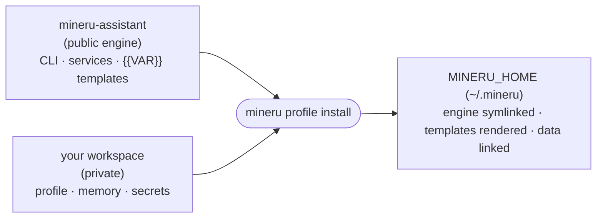

# Architecture

How a running assistant is assembled from this engine and a private workspace. The README stays about using it; this file is about how it is built.

## Two repos, one install

A running assistant is two repos: this public engine and your private workspace.

`mineru profile install` walks `engine/`, symlinks the runtime code into your `MINERU_HOME`, links your private data in, and renders every charter and prompt template from your profile's values (`{{PERSONA_NAME}}`, `{{USER_NAME}}`, `{{MEMORY_ROOT}}`, ...). Editing a rendered file is ephemeral; a lasting change goes to the engine template (generic) or a per-profile override (personal), then you re-install.

- **Engine / profile split**: one shared public engine, one private per-operator workspace. Personal data never enters this repo.
- **Multi-profile**: several independent assistants (yours, a family member's) run on one machine, each with its own persona, memory, secrets, and bot.
- **No hardcoded paths**: every per-host value resolves from `MINERU_HOME` (default `~/.mineru`); each connector reads its own `MINERU_*` variables next to the code it configures.
- **Starter jobs**: the recurring jobs under `engine/recurring/` are a generalizable set you keep, drop, or fork, not a fixed cron.

The install verb was called `hydrate` before 2026-09-16; the old name still works as a hidden alias for about 90 days.

## Layout

| Path | What lives here |
|------|-----------------|
| `mineru_cli/` | CLI package: verbs, wrappers, profile resolution, install, cron |
| `browser/` | Playwright browser-automation server |
| `app/` | read-only, tailnet-only web UI |
| `bin/`, `bin_shims/` | user-facing shell wrappers |
| `scripts/` | firewall, delivery, memory tooling, and other helpers |
| `lib/` | shared library modules |
| `engine/` | install input: `charter/` `prompts/` `recurring/` `launchd/` templates |
| `tests/`, `fixtures/` | pytest suite plus a public synthetic profile for the install rehearsal |

## Keeping the engine operator-agnostic

A hygiene test renders every shipped template against a synthetic profile and fails if a template hardcodes a personal string or leaves an unrendered `{{marker}}`. A companion gate scans the code, tests, and shipping configs the same way. To enforce your own values, list them one per line in `$MINERU_HOME/config/banned-literals.txt` (format: `engine/config/banned-literals.example.txt`); the gates read it automatically and the pytest header reports how many loaded. Extras can be passed as a comma-separated `MINERU_BANNED_LITERALS`.
