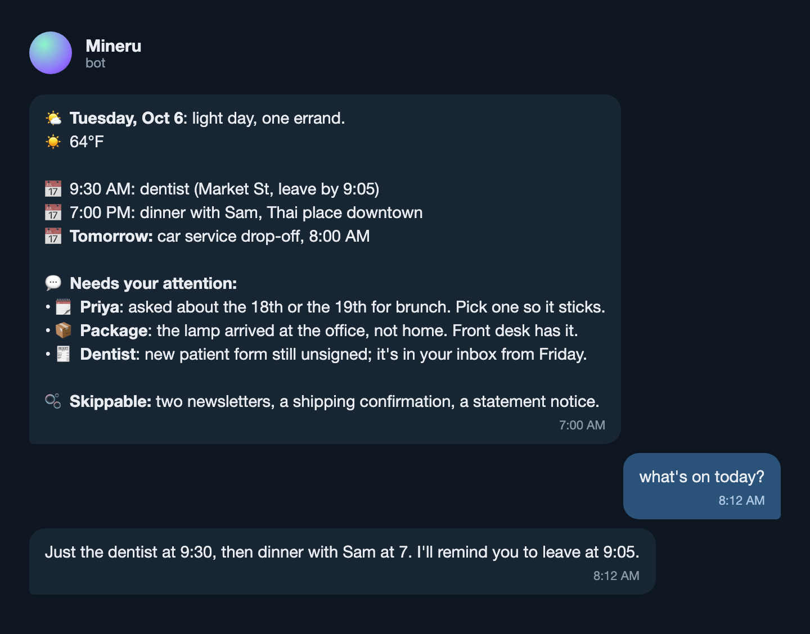

<p align="center">
  
</p>

<p align="center">Wake up to a Telegram message from an assistant who already read your inbox.<br><b>The engine is public. Your life stays on your Mac.</b></p>

<p align="center">
  <a href="./LICENSE"></a>
  <a href="https://www.python.org/downloads/"></a>
  
</p>

---

<p align="center">
  
</p>
<p align="center"><sub>What arrives at 7:00 in the morning, and what happens when you ask it something. Sample data.</sub></p>

It reads your mail, calendar, and texts, remembers what you tell it, and sends you briefs on a schedule. It will not run your life. It will remind you about the dentist.

---

## Get it

```bash
git clone https://github.com/Maninae/mineru-assistant.git
cd mineru-assistant && python3 -m venv .venv && source .venv/bin/activate
pip install -e .
mineru setup
```

`mineru setup` asks for a name, a persona, and a time zone, installs the engine into `~/.mineru`, and walks you through the secrets it needs (a Telegram bot token from BotFather, Google access, a Claude Code login). Then message your bot **"what's on today?"** and it answers. That's the moment it's working.

## What it does

- **Briefs on a schedule**: morning brief, news digest, inbox triage, weekly transactions, a daily curiosity question. Keep the ones you want, drop the rest.
- **Memory that lasts**: daily logs consolidate into long-term notes, searchable by you from the terminal or by the assistant itself.
- **Your accounts, read carefully**: Gmail, Google Calendar, Drive, iMessage, Slack, a browser, your finances. Reads go through a prompt-injection firewall; anything that sends or changes something waits for your go.
- **Private by construction**: this repo is the engine. Your identity, memory, and secrets live in a separate folder you own and never touch this code.
- **More than one assistant per Mac**: each profile gets its own persona, memory, and bot.

> [!NOTE]
> Status: runs the author's assistant every day. Onboarding a fresh operator through `mineru setup` is the part still being smoothed; expect rough edges there, and say so in an issue.

---

Built by one person for one household, and shared in case yours wants one too. **[Architecture](./ARCHITECTURE.md)** · **[Contributing](./CONTRIBUTING.md)** · MIT, see [LICENSE](./LICENSE).
