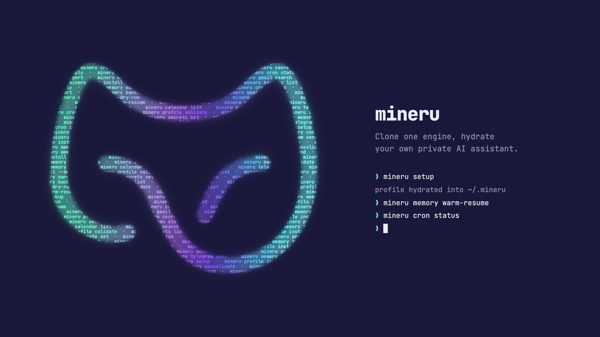
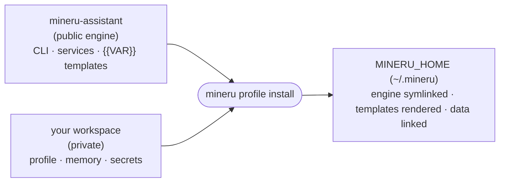

<p align="center">
  
</p>

Clone one engine, hydrate your own private AI assistant.

<p align="center">
  
  
</p>

---

`mineru-assistant` is the public **engine** for a self-hosted personal assistant: the CLI, the runtime services, and the `{{VAR}}` templates. Your identity, memory, connectors, and secrets live in a separate private repo and never touch this one. Clone the engine, point it at your private profile, and hydrate a running assistant into your own workspace.

- **Engine / profile split**: one shared public engine, one private per-operator workspace. Your data is never in this repo.
- **Multi-profile**: several independent agents (yours, a family member's) run on one machine, each with its own persona, memory, secrets, and bot.
- **Template hydration**: charter and prompt files render from your profile (`{{PERSONA_NAME}}`, `{{USER_NAME}}`, `{{MEMORY_ROOT}}`, ...), so the same engine reads as *your* assistant after install.
- **No hardcoded paths**: every per-host value resolves from `MINERU_HOME` (default `~/.mineru`). Nothing assumes a specific user or machine.
- **Starter jobs**: a generalizable set of recurring jobs (briefs, finance, memory upkeep, inbox triage) you keep, drop, or fork. Not a fixed cron.

> [!NOTE]
> Status: early scaffold. This repo stands up the engine surface and a synthetic-fixture hydrate rehearsal. It ships code, tests, and templates only, no personal data. End-to-end hydration into a live workspace is the next milestone.

---

## How it works

A running assistant is assembled from two repos: this public engine and your private workspace.



`mineru profile install` walks `engine/`, symlinks the runtime code into your `MINERU_HOME`, links your private data in, and renders every charter and prompt template from your profile's values. Editing a rendered file is ephemeral; a lasting change goes to the engine template (generic) or a per-profile override (personal), then you re-install. (The verb was called `hydrate` before 2026-09-16; the old name still works as a hidden alias for ~90 days.)

---

## Quick start

Clone your fork and run the suite on any machine, no configuration required:

```bash
git clone <your-fork-url> mineru-assistant
cd mineru-assistant
python3 -m venv .venv && source .venv/bin/activate
pip install -e '.[dev]'
pytest -q
```

The `mineru` command lands on the venv's PATH:

```bash
mineru --help
mineru profile --help
```

---

## Layout

| Path | What lives here |
|------|-----------------|
| `mineru_cli/` | CLI package: verbs, wrappers, profile resolution, hydrate, cron |
| `browser/` | Playwright browser-automation server |
| `app/` | read-only, tailnet-only web UI |
| `bin/`, `bin_shims/` | user-facing shell wrappers |
| `scripts/` | firewall, delivery, memory tooling, and other helpers |
| `lib/` | shared library modules |
| `engine/` | hydrate input: `charter/` `prompts/` `recurring/` `launchd/` templates |
| `tests/`, `fixtures/` | pytest suite plus a public synthetic profile for the hydrate rehearsal |

---

## Configuration

Every per-host value is env-driven, and there are no hardcoded user paths. The root seam is `MINERU_HOME` (default `~/.mineru`); each connector reads its own `MINERU_*` variables next to the code it configures.

A hygiene test renders every shipped template against a synthetic profile and fails if a template hardcodes a personal string or leaves an unrendered `{{marker}}`, which keeps the engine operator-agnostic. A companion gate scans the code, tests, and shipping configs the same way. To enforce your own values, list them one per line in `$MINERU_HOME/config/banned-literals.txt` (format: `engine/config/banned-literals.example.txt`; the gates read it automatically and the pytest header reports how many loaded), or pass extras as a comma-separated `MINERU_BANNED_LITERALS`.

---

## License

MIT. See [LICENSE](./LICENSE).
